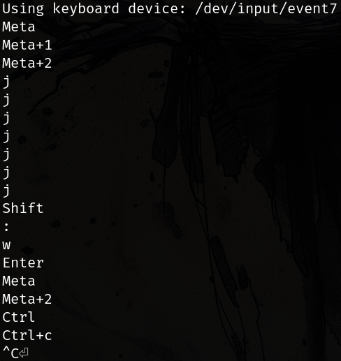

# Keylogger



This is an implementation of a keylogger that records keyboard input.
The primary purpose of this code is for demonstration and to understand the concepts involved in creating a keylogger in a Linux environment.

## Usage

```sh
make
```

Use `sudo` to run. The keylogger will display output in the terminal by default. Use the `-w` option to write the output to a `.log` file.

If target device is incorrect. Use the `-dev <NAME>` option to specify a device. List available devices with `ls -l /dev/input/by-id/`

Example:

```sh
sudo out/keylogger -dev usb-Keychron_Keychron_K11_Pro-event-kbd
```

## Formatter

`~/.clang-format` base from [Google](https://google.github.io/styleguide/cppguide.html)

```
BasedOnStyle: Google
IndentWidth: 4
ColumnLimit: 120
```

_In Google i trust_
