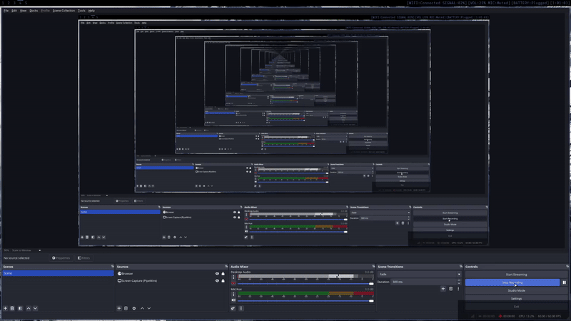

# Keylogger


## Build and Usage

```sh
gcc -o nob nob.c
./nob
sudo out/keylogger --printk
```

Use `sudo` to run. The keylogger outputs to the `/tmp/.keylogger.log` file. You can also get output via a WebSocket. However, this requires the [libwebsockets](https://libwebsockets.org) library. Install libwebsockets and then run:

```sh
./nob -lwebsockets
```

If target device is incorrect. Use the `--dev <PATH>` option to specify a device event. List available devices run `ls -l /dev/input/by-id/`

```sh
sudo out/keylogger --dev /dev/input/event7 --printk
```

There is a list of options available

| Option         | Default Value       | Description                         |
| -------------- | ------------------- | ----------------------------------- |
| `--dev`        | `/dev/input/event?` | Specify the device event to use     |
| `--no-log`     |                     | Disable writing key to the log file |
| `--printk`     |                     | Show keystrokes in terminal         |
| `--port`       | `33300`             | Specify websocket port              |
| `-h`, `--help` |                     | Display help message and exit       |

Want to try using Nix?

```sh
nix run github:ryhkml/keylogger -- --dev /dev/input/event? --printk
```

**or** build with libwebsockets.

```sh
nix run github:ryhkml/keylogger#with-websockets -- --dev /dev/input/event?
```

### WebSocket Secure (wss)

The keylogger server also supports secure WebSocket connections. Set an environment variable with the path to your certificate and private key files.

```sh
# Required
export KEYLOGGER_SSL_CERT_PATH=PATH_TO_CERT.pem
export KEYLOGGER_SSL_KEY_PATH=PATH_TO_KEY.pem
# Optional
export KEYLOGGER_SSL_CA_PATH=
```

```html
<!-- Just create an index.html file as a client to receive keystrokes from the server -->
<!doctype html>
<html>
    <head>
        <style></style>
        <script defer>
            const ws = new WebSocket("wss://127.0.0.1:33300");
            ws.onmessage = ({ data }) => {
                // Do something..
            };
        </script>
    </head>
    <body>
        <!-- Design your own keystrokes -->
    </body>
</html>
```

> [!NOTE]
>
> Please note that you also need to add the authority certificate file to the browser you are using.
> This file is usually in the `.crt` format.

#### Example

A keylogger used as an overlay in OBS:



### Test

```sh
./nob test
```

### Rootless

> [!WARNING]
>
> Rootless method gives you direct access to your keyboard.

To run rootless, follow these steps:

1. Create a udev rules file (for example, `/etc/udev/rules.d/90-keylogger.rules`)

    ```sh
    echo "SUBSYSTEM==\"input\", OWNER=\"$USER\", MODE=\"0660\"" | sudo tee /etc/udev/rules.d/90-keylogger.rules > /dev/null
    ```

1. Reload udev rules
    ```sh
    sudo udevadm control --reload-rules
    sudo udevadm trigger
    sudo rm -f /tmp/.keylogger.log
    ```

## Formatter

`.clang-format` is based on [Google](https://google.github.io/styleguide/cppguide.html) style guide

```
BasedOnStyle: Google
IndentWidth: 4
ColumnLimit: 120
AlignArrayOfStructures: Left
AlignAfterOpenBracket: Align
BracedInitializerIndentWidth: 4
```

_In Google i trust_
