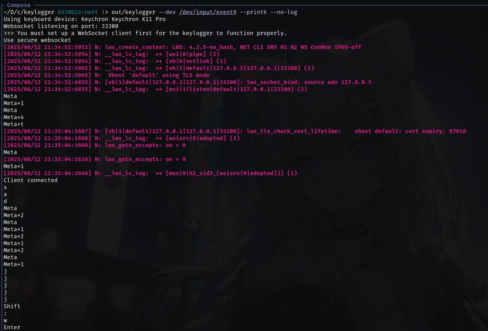

# Keylogger



This is a simple implementation of a keylogger that records keyboard input.
The primary purpose of this code is for demonstration and learning about the fundamental concepts involved in creating a keylogger in a Linux environment.

> [!WARNING]
>
> Be careful when typing passwords or anything confidential 💀💀💀

## Usage

```sh
cc main.c -o out/keylogger
```

Use `sudo` to run. The keylogger will display output in the terminal by default. Use the `-w` option to write the output to a .log file.

## Formatter

`~/.clang-format` base from [Google](https://google.github.io/styleguide/cppguide.html)

```
BasedOnStyle: Google                                                                                                                                                                                            │
IndentWidth: 4                                                                                                                                                                                                  │
ColumnLimit: 120
```

**In Google i trust**
